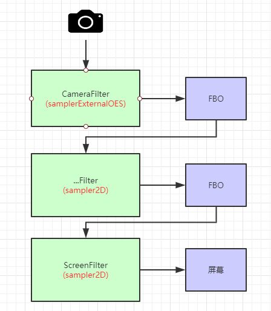
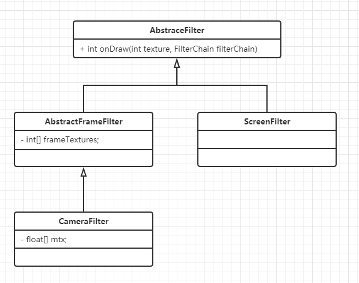

# OpenGL ES. GLSL 语法

着色器的使用流程


opengl 使用


FBO 


# 知识点
CameraX 获取图像

GLSL 语法

GLSurfaceView

FBO ---- Frame Buffer Object

ScreenFilter

CameraFilter

摄像头数据 RGB/YUv: byte[]---> MediaCodec --> byte[]

OpenGL 操作 一直在操作纹理ID，没有图像byte数组数据，如何用MediaCodec编码?

Q:  Surface surface = mediaCodec.createinputsurface 

OpenGL 向surface 画画，MediaCodec就能编码 surface 的图像

OpenGL 如何 向surface 画画?

Android EGL 管理窗口显示。

OpengGL: 画笔工具，不管窗口，因为各个平台的窗口机制不一样。Android/IOS/WINDOWS
EGL: Android 里面管理窗口的一套Api，egl库初始化OpenGL的环境
EGL库---> Suface 与 EglSurface关联。OpenGL 通过EGL环境，像EglSurface 画画

思路： Suface 与 EglSurface绑定


# 结构

CameraRender 渲染器

ScreenFilter --- 着色器 sampler2D

CameraFilter --- 着色器 samplerExternalOES

FBO --- 中间存储 --- ScreenFilter/CameraFilter 在FBO 操作数据

过滤器类结构



eetaFace2 人脸定位，免费中挺好的

https://github.com/seetafaceengine/SeetaFace2

# 应用

抖音大眼萌效果

添加责任链模式，每个滤镜相当于一个节点，我们的效果就可以叠加，单独专心写滤镜就好


# shader frag 备份

大眼

```
precision mediump float;//数据精度
varying vec2 aCoord;
uniform sampler2D vTexture;// samplerExternalOES 图片，采样器
uniform vec2 left_eye;//float[2] -> x,y
uniform vec2 right_eye;

//r: 要画的点与眼睛的距离
//max 最大半径
//0.4 放大系数 -1 -- 1 大于0 就是放大

float fs(float r,float rmax){
//return (1.0-pow(r/rmax-1.0,2.0)* 0.5)*r;

    return (1.0-pow(r/rmax-1.0,2.0)* 0.3);

}

vec2 newCoord(vec2 coord,vec2 eye,float rmax){
    vec2 p = cood;
    //得到要画的点coord，与眼睛的距离
    float r = distance(coord,eye);
    if(r < rmax){
        // 在这个范围,新的点与眼睛的距离
        float fsr = fs(r,rmax);
        // （缩放后的点- 眼睛的点）/（原点-眼睛的点）= fsr /r
        //缩放的点=fsr/r * (原点-眼睛的点) + 眼睛的点
//        p = fsr/r*(coord-eye) + eye;
        // 优化 抵消掉，这需要除，上面公式需要乘
        p = fsr/(coord-eye) + eye;
    }

    return p;
}

void main(){
//    gl_FragColor = texture2D(vTexture,aCoord);//从图片中找到像素点，赋值

    float rmax = distance(left_eye,right_eye)/2.0;
    vec2 p =  newCoord(aCoord,left_eye,rmax);
    p =  newCoord(aCoord,right_eye,rmax);

    gl_FragColor = texture2D(vTexture,p);//从图片中找到像素点，赋值


}


```