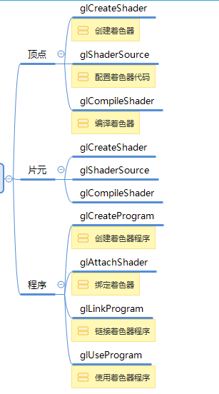
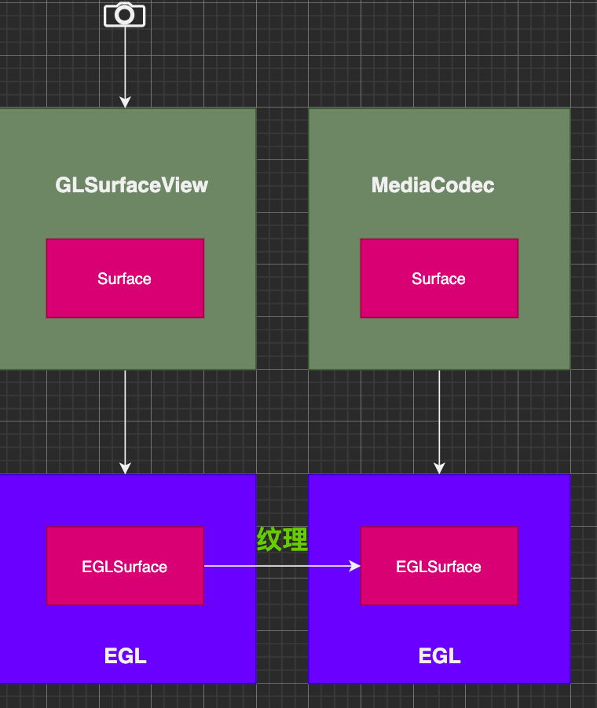

# OpenGL ES. GLSL 语法

着色器的使用流程

opengl 使用

# 知识点
CameraX 获取图像

GLSL 语法

GLSurfaceView

FBO

ScreenFilter

CameraFilter

摄像头数据 RGB/YUv: byte[]---> MediaCodec --> byte[]

OpenGL 操作 一直在操作纹理ID，没有图像byte数组数据，如何用MediaCodec编码?

Q:  Surface surface = mediaCodec.createinputsurface 

OpenGL 向surface 画画，MediaCodec就能编码 surface 的图像

OpenGL 如何 向surface 画画?

Android EGL 管理窗口显示。

OpengGL: 画笔工具，不管窗口，因为各个平台的窗口机制不一样。Android/IOS/WINDOWS
EGL: Android 里面管理窗口的一套Api，egl库初始化OpenGL的环境
EGL库---> Suface 与 EglSurface关联。OpenGL 通过EGL环境，像EglSurface 画画

思路： Suface 与 EglSurface绑定

# 结构

CameraRender 渲染器

ScreenFilter --- 着色器 sampler2D

CameraFilter --- 着色器 samplerExternalOES

FBO --- 中间存储 --- ScreenFilter/CameraFilter 在FBO 操作数据

