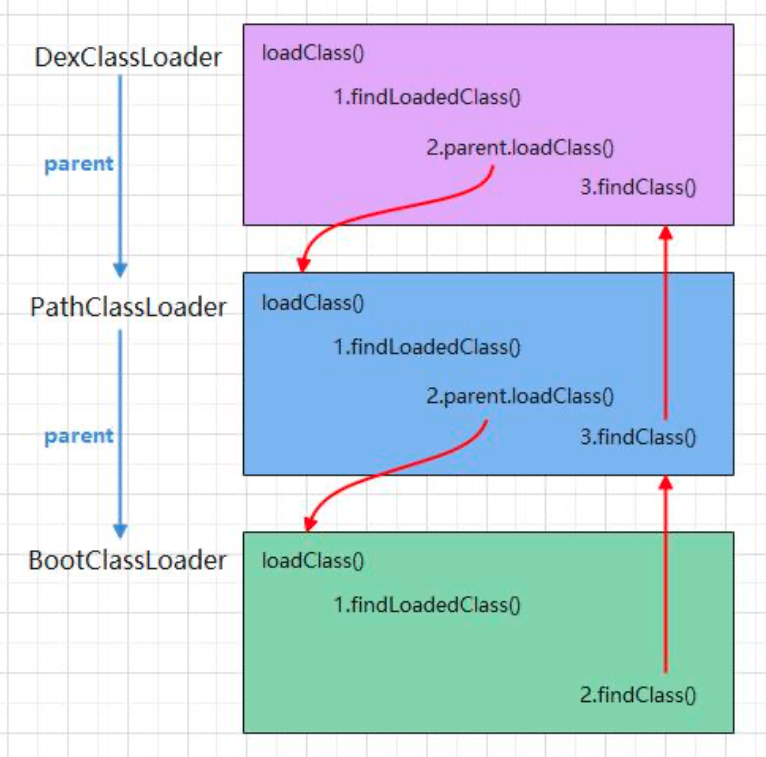
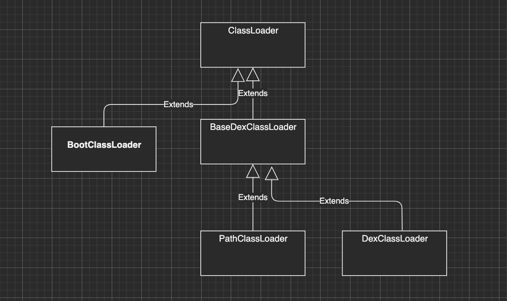
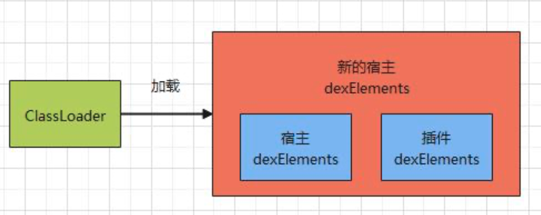

# 插件化思想和知识点

## 类加载

加载------> 验证 ----->  准备------> 解析
                                    |->初始化->使用->卸载
                                    
加载阶段，虚拟机做三件事：
1.通过一个类的全限定名来获取定义此类的二 进制字节流。
2.将这个字节流所代表的静态存储结构转化为 方法区域的运行时数据结构。
3.在Java堆中生成一个代表这个类的Class对象， 作为方法区域数据的访问入口

## 反射

Class  --- 一切皆对象

Car 类  --- Class 类

Person  --- Class 类

伪代码

Class Person{
	private static int age; // Field 类
}

Person.age  = 19;

Field  ageField = Class.getField("age"); // new Person().age  
int leo =  age
当 是静态的时候，ageField.get(null); -- 非静态 ageField.get(new Person);
ageField.set();

为什么我们说反射会有一定的降低效率

1. 产生大量的临时对象
2. 检查可见性 
3. 会生成字节码 --- 没有优化
4. 类型转换


# ClassLoader BootClassLoader PathClassLoader DexClassLoader


在8.0(API 26)之前，它们二者的唯一区别是 第二个参数 optimizedDirectory，这个参数的意 思是生成的 odex(优化的dex)存放的路径。
在8.0(API 26)及之后，二者就完全一样了。

BaseDexClassLoader extends ClassLoader
BootClassLoder extends ClassLoader
DexClassLoader extends BaseDexClassLoader
PathClassLoader extends BaseDexClassLoader
```
public class DexClassLoader extends BaseDexClassLoader {
    
    public DexClassLoader(String dexPath, String optimizedDirectory,
            String librarySearchPath, ClassLoader parent) {
        super(dexPath, null, librarySearchPath, parent);
    }
}
```

```

package dalvik.system;

public class PathClassLoader extends BaseDexClassLoader {
    
    public PathClassLoader(String dexPath, ClassLoader parent) {
        super(dexPath, null, null, parent);
    }

    
    public PathClassLoader(String dexPath, String librarySearchPath, ClassLoader parent) {
        super(dexPath, null, librarySearchPath, parent);
    }
}

```


PathClassLoader --》 parent（ClassLoader类型的对象），BootClassLoader 没有parent

PathClassLoader  --- 应用的 类 -- 第三方库  
BootClassLoader  --- SDK的类

Activity 是SDK 而不是FrameWork,而AppCompatActivity 是依赖库中的
类似Glide 都是第三方集成的依赖。

双亲委派机制




## Hook

查找  Hook  反射 启动插件的类

dexFile --- 对应一个 dex 文件

Element -- dexFile  --- apk  多个dex文件

Element[] dexElements -- 一个app的所有 class 文件都在 dexElements 里面

因为 宿主的MainActivity  在  宿主 的  dexElements 里面

1.获取宿主dexElements
2.获取插件dexElements
3.合并两个dexElements
4.将新的dexElements 赋值到 宿主dexElements

目标：dexElements  -- DexPathList类的对象 -- BaseDexClassLoader的对象，类加载器

获取的是宿主的类加载器  --- 反射 dexElements  宿主 

获取的是插件的类加载器  --- 反射 dexElements  插件


流程,对应这个类进行分析

```aidl
ClassLoader----DexPathList---Element----DexFile----BootClassLoader---VMClassLoader----Class
```




# 插件化启动

- 宿主启动插件类

- 宿主启动插件的某个dex文件

- 宿主启动插件的Activity

- 宿主加载插件资源