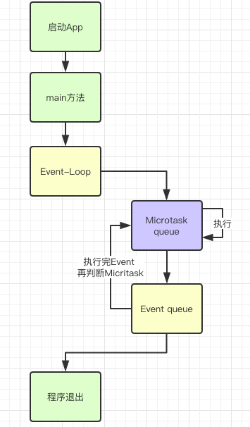

# 异步编程

[TOC]


## isolate机制

​	Dart是基于单线程模型的语言。但是在开发当中我们经常会进行耗时操作比如网络请求，这种耗时操作会堵塞我们的代码，所以在Dart也有并发机制，名叫**isolate**。APP的启动入口`main`函数就是一个类似Android主线程的一个主isolate。和Java的Thread不同的是，Dart中的isolate无法共享内存。


```dart
import 'dart:isolate';

int i;

void main() {
  i = 10;
  //创建一个消息接收器
  ReceivePort receivePort = new ReceivePort();
  //创建isolate
  Isolate.spawn(isolateMain, receivePort.sendPort);

  //接收其他isolate发过来的消息
  receivePort.listen((message) {
    //发过来sendPort,则主isolate也可以向创建的isolate发送消息
    if (message is SendPort) {
      message.send("好呀好呀!");
    } else {
      print("接到子isolate消息:" + message);
    }
  });
}

/// 新isolate的入口函数
void isolateMain(SendPort sendPort) {
  // isolate是内存隔离的，i的值是在主isolate定义的所以这里获得null
  print(i);

  ReceivePort receivePort = new ReceivePort();
  sendPort.send(receivePort.sendPort);


  // 向主isolate发送消息
  sendPort.send("去大保健吗？");


  receivePort.listen((message) {
    print("接到主isolate消息:" + message);
  });
}
```


### event-loop	

​	可以看到代码中，我们接收消息使用了`listene`函数来监听消息。假设我们现在在main方法最后加入`sleep`休眠，会不会影响`listene`回调的时机？

```dart
import 'dart:io';
import 'dart:isolate';

int i;

void main() {
  i = 10;
  //创建一个消息接收器
  ReceivePort receivePort = new ReceivePort();
  //创建isolate
  Isolate.spawn(isolateMain, receivePort.sendPort);

  //接收其他isolate发过来的消息
  receivePort.listen((message) {
    //发过来sendPort,则主isolate也可以向创建的isolate发送消息
    if (message is SendPort) {
      message.send("好呀好呀!");
    } else {
      print("接到子isolate消息:" + message);
    }
  });

  //增加休眠，是否会影响listen的时机？
  sleep(Duration(seconds: 2));
  print("休眠完成");
}

/// 新isolate的入口函数
void isolateMain(SendPort sendPort) {
  // isolate是内存隔离的，i的值是在主isolate定义的所以这里获得null
  print(i);

  ReceivePort receivePort = new ReceivePort();
  sendPort.send(receivePort.sendPort);
  // 向主isolate发送消息
  sendPort.send("去大保健吗？");


  receivePort.listen((message) {
    print("接到主isolate消息:" + message);
  });
}
```

​	结果是大概2s后，我们的`listene`才打印出其他isolate发过来的消息。同Android Handler类似，在Dart运行环境中也是靠事件驱动的，通过event loop不停的从队列中获取消息或者事件来驱动整个应用的运行，isolate发过来的消息就是通过loop处理。但是不同的是在Android中每个线程只有一个Looper所对应的MessageQueue，而Dart中有两个队列，一个叫做**event queue(事件队列)**，另一个叫做**microtask queue(微任务队列)**。



​	Dart在执行完main函数后，就会由Loop开始执行两个任务队列中的Event。首先Loop检查微服务队列，依次执行Event，当微服务队列执行完后，就检查Event queue队列依次执行，在执行Event queue的过程中，没执行完一个Event就再检查一次微服务队列。所以微服务队列优先级高，可以利用微服务进行插队。


我们先来看个例子:

```dart

import 'dart:io';

void main(){
  new File("/Users/enjoy/a.txt").readAsString().then((content){
      print(content);
  });
  while(true){}
}
```

文件内容永远也无法打印出来，因为main函数还没执行完。而then方法是由Loop检查Event queue执行的。

如果需要往微服务中插入Event进行插队：

```dart

import 'dart:async';
import 'dart:io';
//结果是限制性了microtask然后执行then方法。
void main(){
  new File("/Users/enjoy/a.txt").readAsString().then((content){
      print(content);
  });
  //future内部就是调用了 scheduleMicrotask
  Future.microtask((){
    print("future: excute microtask");

  });
//  scheduleMicrotask((){
//    print("");
//  });

}
```


## Future

​	在 Dart 库中随处可见 Future 对象，通常异步函数返回的对象就是一个 Future。 当一个 future *执行完后*，他里面的值 就可以使用了，可以使用 `then()` 来在 future 完成的时候执行其他代码。Future对象其实就代表了在事件队列中的一个事件的结果。

### 异常

```dart
//当给到一个不存在的文件地址时会发生异常，这时候可以利用catchError捕获此异常。
//then().catchError() 模式就是异步的 try-catch。
new File("/Users/enjoy/a1.txt").readAsString().then((content) {
    print(content);
  }).catchError((e, s) {
    print(s);
  });
```

### 组合

`then()`的返回值同样是一个future对象，可以利用队列的原理进行组合异步任务

```dart
  new File("/Users/enjoy/a.txt").readAsString().then((content) {
    print(content);
    return 1; //1被转化为 Future<int>类型 返回
  }).then((i){
    print(i);
  }).catchError((e, s) {
    print(s);
  });
```

上面的方式是等待执行完成读取文件之后，再执行一个新的future。如果我们需要等待一组任务都执行完成再统一处理一些事情，可以通过`wait()`完成。

```dart
 Future readDone = new File("/Users/enjoy/a.txt").readAsString();
  //延迟3s
  Future delayedDone = Future.delayed(Duration(seconds: 3));

  Future.wait([readDone, delayedDone]).then((values) {
     print(values[0]);//第一个future的结果
     print(values[1]);//第二个future的结果
  });
```


## Stream

​	Stream(流) 在 Dart API 中也经常出现，表示发出的一系列的异步数据。 Stream 是一个异步数据源，它是 Dart 中处理异步事件流的统一 API。

​	Future 表示稍后获得的一个数据，所有异步的操作的返回值都用 Future 来表示。但是 Future 只能表示一次异步获得的数据。而 Stream 表示多次异步获得的数据。比如 IO 处理的时候，每次只会读取一部分数据和一次性读取整个文件的内容相比，Stream 的好处是处理过程中内存占用较小。而 File 的 `readAsString()`是一次性读取整个文件的内容进来，虽然获得完整内容处理起来比较方便，但是如果文件很大的话就会导致内存占用过大的问题。

```dart
 new File("/Users/enjoy/app-release.apk").openRead().listen((List<int> bytes) {
    print("stream执行"); //执行多次
  });

  new File("/Users/enjoy/app-release.apk").readAsBytes().then((_){
    print("future执行"); //执行1次
  });
```

`listen()`其实就是订阅这个Stream，它会返回一个`StreamSubscription`订阅者。订阅者肯定就提供了取消订阅的`cancel()`，去掉后我们的listen中就接不到任何信息了。除了`cancel()`取消方法之外，我们还可以使用`onData()`重置listene方法，`onDone`监听完成等等操作。

```dart
  StreamSubscription<List<int>> listen = new File("/Users/enjoy/app-release.apk").openRead().listen((List<int> bytes) {
    print("stream执行");
  });
  listen.onData((_){
    print("替代listene");
  });
  listen.onDone((){
    print("结束");
  });
  listen.onError((e,s){
    print("异常");
  });
  //暂停，如果没有继续则会退出程序
  listen.pause();
  //继续
  listen.resume();
```


### 广播模式

​	Stream有两种订阅模式：单订阅和多订阅。单订阅就是只能有一个订阅者，上面的使用我们都是单订阅模式，而广播是可以有多个订阅者。通过 Stream.asBroadcastStream() 可以将一个单订阅模式的 Stream 转换成一个多订阅模式的 Stream，isBroadcast 属性可以判断当前 Stream 所处的模式。

```dart
var stream = new File("/Users/enjoy/app-release.apk").openRead();
  stream.listen((List<int> bytes) {
  });
  //错误 单订阅只能有一个订阅者
//  stream.listen((_){
//    print("stream执行");
//  });

  var broadcastStream = new File("/Users/enjoy/app-release.apk").openRead().asBroadcastStream();
  broadcastStream.listen((_){
    print("订阅者1");
  });
  broadcastStream.listen((_){
    print("订阅者2");
  });
```

需要注意的是，多订阅模式如果没有及时添加订阅者则可能丢数据。

```dart
//默认是单订阅
  var stream = Stream.fromIterable([1, 2, 3]);
  //3s后添加订阅者 不会丢失数据
  new Timer(new Duration(seconds: 3), () => stream.listen(print));

  //创建一个流管理器 对一个stream进行管理
  var streamController = StreamController.broadcast();
  //添加
  streamController.add(1);
  //先发出事件再订阅 无法接到通知
  streamController.stream.listen((i){
    print("broadcast:$i");
  });
  //记得关闭
  streamController.close();


  //这里没有丢失，因为stream通过asBroadcastStream转为了多订阅，但是本质是单订阅流，并不改变原始 stream 的实现特性
  var broadcastStream = Stream.fromIterable([1, 2, 3]).asBroadcastStream();
  new Timer(new Duration(seconds: 3), () => broadcastStream.listen(print));
```


## async/await

​		使用`async`和`await`的代码是异步的，但是看起来很像同步代码。当我们需要获得A的结果，再执行B，时，你需要`then()->then()`,但是利用`async`与`await`能够非常好的解决回调地狱的问题：

```dart
//async 表示这是一个异步方法,await必须再async方法中使用
//异步方法只能返回 void和Future
Future<String> readFile() async {
  //await 等待future执行完成再执行后续代码
  String content = await new File("/Users/xiang/enjoy/a.txt").readAsString();
  String content2 = await new File("/Users/xiang/enjoy/a.txt").readAsString();
  //自动转换为 future
  return content;
}
```


## 作业

利用多订阅广播，如何来实现一个Event-Bus?