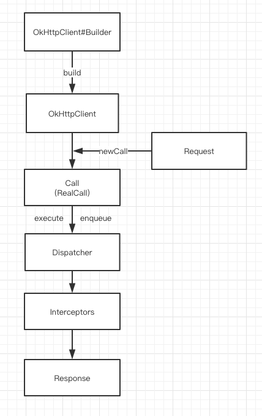
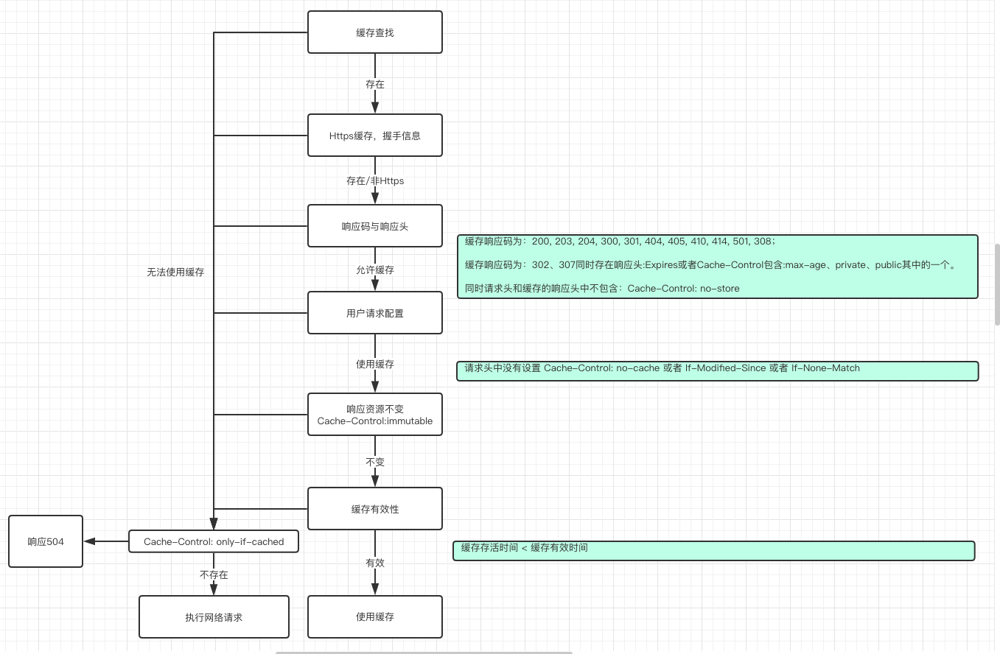

# OkHttp原理解析

> OkHttp 3.10.0版本，最新OkHttp为：4.0.1逻辑与3版本并没有太大变化，但是改为kotlin实现。

## OkHttp介绍

OkHttp是当下Android使用最频繁的网络请求框架，由Square公司开源。Google在Android4.4以后开始将源码中的HttpURLConnection底层实现替换为OKHttp，同时现在流行的Retrofit框架底层同样是使用OKHttp的。

优点:

- 支持Spdy、Http1.X、Http2、Quic以及WebSocket
- 连接池复用底层TCP(Socket)，减少请求延时
- 无缝的支持GZIP减少数据流量
- 缓存响应数据减少重复的网络请求
- 请求失败自动重试主机的其他ip，自动重定向
- …….


## 使用流程




在使用OkHttp发起一次请求时，对于使用者最少存在`OkHttpClient`、`Request`与`Call`三个角色。其中`OkHttpClient`和`Request`的创建可以使用它为我们提供的`Builder`（建造者模式）。而`Call`则是把`Request`交给`OkHttpClient`之后返回的一个已准备好执行的请求。

> 建造者模式：将一个复杂的构建与其表示相分离，使得同样的构建过程可以创建不同的表示。实例化OKHttpClient和Request的时候，因为有太多的属性需要设置，而且开发者的需求组合千变万化，使用建造者模式可以让用户不需要关心这个类的内部细节，配置好后，建造者会帮助我们按部就班的初始化表示对象

同时OkHttp在设计时采用的门面模式，将整个系统的复杂性给隐藏起来，将子系统接口通过一个客户端OkHttpClient统一暴露出来。

`OkHttpClient`中全是一些配置，比如代理的配置、ssl证书的配置等。而`Call`本身是一个接口，我们获得的实现为:`RealCall`

```java
static RealCall newRealCall(OkHttpClient client, Request originalRequest, boolean forWebSocket) {
    // Safely publish the Call instance to the EventListener.
    RealCall call = new RealCall(client, originalRequest, forWebSocket);
    call.eventListener = client.eventListenerFactory().create(call);
    return call;
}
```

`Call`的`execute`代表了同步请求，而`enqueue`则代表异步请求。两者唯一区别在于一个会直接发起网络请求，而另一个使用OkHttp内置的线程池来进行。这就涉及到OkHttp的任务分发器。


## 分发器

`Dispatcher`，分发器就是来调配请求任务的，内部会包含一个线程池。可以在创建`OkHttpClient`时，传递我们自己定义的线程池来创建分发器。

这个Dispatcher中的成员有:

```java
//异步请求同时存在的最大请求
private int maxRequests = 64;
//异步请求同一域名同时存在的最大请求
private int maxRequestsPerHost = 5;
//闲置任务(没有请求时可执行一些任务，由使用者设置)
private @Nullable Runnable idleCallback;

//异步请求使用的线程池
private @Nullable ExecutorService executorService;

//异步请求等待执行队列
private final Deque<AsyncCall> readyAsyncCalls = new ArrayDeque<>();

//异步请求正在执行队列
private final Deque<AsyncCall> runningAsyncCalls = new ArrayDeque<>();

//同步请求正在执行队列
private final Deque<RealCall> runningSyncCalls = new ArrayDeque<>();
```

### 同步请求

```java
synchronized void executed(RealCall call) {
	runningSyncCalls.add(call);
}
```

因为同步请求不需要线程池，也不存在任何限制。所以分发器仅做一下记录。


### 异步请求

```java
synchronized void enqueue(AsyncCall call) {
	if (runningAsyncCalls.size() < maxRequests && runningCallsForHost(call) < maxRequestsPerHost) 	  {
		runningAsyncCalls.add(call);
		executorService().execute(call);
	} else {
		readyAsyncCalls.add(call);
	}
}
```

当正在执行的任务未超过最大限制64，同时`runningCallsForHost(call) < maxRequestsPerHost`同一Host的请求不超过5个，则会添加到正在执行队列，同时提交给线程池。否则先加入等待队列。

加入线程池直接执行没啥好说的，但是如果加入等待队列后，就需要等待有空闲名额才开始执行。因此每次执行完一个请求后，都会调用分发器的`finished`方法

```java
//异步请求调用
void finished(AsyncCall call) {
	finished(runningAsyncCalls, call, true);
}
//同步请求调用
void finished(RealCall call) {
	finished(runningSyncCalls, call, false);
}

private <T> void finished(Deque<T> calls, T call, boolean promoteCalls) {
	int runningCallsCount;
	Runnable idleCallback;
	synchronized (this) {
        //不管异步还是同步，执行完后都要从队列移除(runningSyncCalls/runningAsyncCalls)
		if (!calls.remove(call)) throw new AssertionError("Call wasn't in-flight!");
		if (promoteCalls) promoteCalls();
        //异步任务和同步任务正在执行的和
		runningCallsCount = runningCallsCount();
		idleCallback = this.idleCallback;
	}
	// 没有任务执行执行闲置任务
	if (runningCallsCount == 0 && idleCallback != null) {
		idleCallback.run();
	}
}
```

需要注意的是 只有异步任务才会存在限制与等待，所以在执行完了移除正在执行队列中的元素后，异步任务结束会执行`promoteCalls()`。很显然这个方法肯定会重新调配请求。

```java
private void promoteCalls() {
    //如果任务满了直接返回
	if (runningAsyncCalls.size() >= maxRequests) return; 
    //没有等待执行的任务，返回
	if (readyAsyncCalls.isEmpty()) return; 
    //遍历等待执行队列
	for (Iterator<AsyncCall> i = readyAsyncCalls.iterator(); i.hasNext(); ) {
		AsyncCall call = i.next();
        //等待任务想要执行，还需要满足：这个等待任务请求的Host不能已经存在5个了
		if (runningCallsForHost(call) < maxRequestsPerHost) {
			i.remove();
			runningAsyncCalls.add(call);
			executorService().execute(call);
		}

		if (runningAsyncCalls.size() >= maxRequests) return; // Reached max capacity.
	}
}
```

在满足条件下，会把等待队列中的任务移动到`runningAsyncCalls`并交给线程池执行。所以分发器到这里就完了。逻辑上还是非常简单的。


### 请求流程

用户是不需要直接操作任务分发器的，获得的`RealCall `中就分别提供了`execute`与`enqueue`来开始同步请求或异步请求。

```java
@Override public Response execute() throws IOException {
    synchronized (this) {
      if (executed) throw new IllegalStateException("Already Executed");
      executed = true;
    }
    captureCallStackTrace();
    eventListener.callStart(this);
    try {
      //调用分发器
      client.dispatcher().executed(this);
      //执行请求
      Response result = getResponseWithInterceptorChain();
      if (result == null) throw new IOException("Canceled");
      return result;
    } catch (IOException e) {
      eventListener.callFailed(this, e);
      throw e;
    } finally {
      //请求完成
      client.dispatcher().finished(this);
    }
}
```

异步请求的后续同时是调用`getResponseWithInterceptorChain()`来执行请求

```java
@Override
public void enqueue(Callback responseCallback) {
	synchronized (this) {
		if (executed) throw new IllegalStateException("Already Executed");
		executed = true;
	}
	captureCallStackTrace();
	eventListener.callStart(this);
    //调用分发器
	client.dispatcher().enqueue(new AsyncCall(responseCallback));
}
```

如果该`RealCall`已经执行过了，再次执行是不允许的。异步请求会把一个`AsyncCall`提交给分发器。

`AsyncCall`实际上是一个`Runnable`的子类,使用线程启动一个`Runnable`时会执行`run`方法，在`AsyncCall`中被重定向到`execute`方法:

```java
final class AsyncCall extends NamedRunnable {
	private final Callback responseCallback;

	AsyncCall(Callback responseCallback) {
		super("OkHttp %s", redactedUrl());
		this.responseCallback = responseCallback;
	}

    //线程池执行
	@Override
	protected void execute() {
	 boolean signalledCallback = false;
      try {
        Response response = getResponseWithInterceptorChain();
       //.......
      } catch (IOException e) {
       //......
      } finally {
        //请求完成
        client.dispatcher().finished(this);
      }
    }
}

public abstract class NamedRunnable implements Runnable {
    protected final String name;

    public NamedRunnable(String format, Object... args) {
        this.name = Util.format(format, args);
    }

    @Override
    public final void run() {
        String oldName = Thread.currentThread().getName();
        Thread.currentThread().setName(name);
        try {
            execute();
        } finally {
            Thread.currentThread().setName(oldName);
        }
    }

    protected abstract void execute();
}
```

同时`AsyncCall`也是`RealCall`的普通内部类，这意味着它是持有外部类`RealCall`的引用，可以获得直接调用外部类的方法。

可以看到无论是同步还是异步请求实际上真正执行请求的工作都在`getResponseWithInterceptorChain()`中。这个方法就是整个OkHttp的核心：拦截器责任链。但是在介绍责任链之前，我们再来回顾一下线程池的基础知识。


### 分发器线程池

前面我们提过，分发器就是来调配请求任务的，内部会包含一个线程池。当异步请求时，会将请求任务交给线程池来执行。那分发器中默认的线程池是如何定义的呢？为什么要这么定义？

```java
public synchronized ExecutorService executorService() {
    if (executorService == null) {
      executorService = new ThreadPoolExecutor(
          					0,   				//核心线程
                            Integer.MAX_VALUE,  //最大线程
                            60,					//空闲线程闲置时间
                            TimeUnit.SECONDS,	//闲置时间单位
                            new SynchronousQueue<Runnable>(), //线程等待队列
                            Util.threadFactory("OkHttp Dispatcher", false) //线程创建工厂
      );
    }
    return executorService;
}
```

在OkHttp的分发器中的线程池定义如上，其实就和`Executors.newCachedThreadPool()`创建的线程一样。首先核心线程为0，表示线程池不会一直为我们缓存线程，线程池中所有线程都是在60s内没有工作就会被回收。而最大线程`Integer.MAX_VALUE`与等待队列`SynchronousQueue`的组合能够得到最大的吞吐量。即当需要线程池执行任务时，如果不存在空闲线程不需要等待，马上新建线程执行任务！等待队列的不同指定了线程池的不同排队机制。一般来说，等待队列`BlockingQueue`有：`ArrayBlockingQueue`、`LinkedBlockingQueue`与`SynchronousQueue`。


假设向线程池提交任务时，核心线程都被占用的情况下：

`ArrayBlockingQueue`：基于数组的阻塞队列，初始化需要指定固定大小。

​	当使用此队列时，向线程池提交任务，会首先加入到等待队列中，当等待队列满了之后，再次提交任务，尝试加入队列就会失败，这时就会检查如果当前线程池中的线程数未达到最大线程，则会新建线程执行新提交的任务。所以最终可能出现后提交的任务先执行，而先提交的任务一直在等待。

`LinkedBlockingQueue`：基于链表实现的阻塞队列，初始化可以指定大小，也可以不指定。

​	当指定大小后，行为就和`ArrayBlockingQueu`一致。而如果未指定大小，则会使用默认的`Integer.MAX_VALUE`作为队列大小。这时候就会出现线程池的最大线程数参数无用，因为无论如何，向线程池提交任务加入等待队列都会成功。最终意味着所有任务都是在核心线程执行。如果核心线程一直被占，那就一直等待。

`SynchronousQueue` : 无容量的队列。

​	使用此队列意味着希望获得最大并发量。因为无论如何，向线程池提交任务，往队列提交任务都会失败。而失败后如果没有空闲的非核心线程，就会检查如果当前线程池中的线程数未达到最大线程，则会新建线程执行新提交的任务。完全没有任何等待，唯一制约它的就是最大线程数的个数。因此一般配合`Integer.MAX_VALUE`就实现了真正的无等待。


但是需要注意的时，我们都知道，进程的内存是存在限制的，而每一个线程都需要分配一定的内存。所以线程并不能无限个数。那么当设置最大线程数为`Integer.MAX_VALUE`时，OkHttp同时还有最大请求任务执行个数: 64的限制。这样即解决了这个问题同时也能获得最大吞吐。


## 拦截器责任链

OkHttp最核心的工作是在`getResponseWithInterceptorChain()`中进行，在进入这个方法分析之前，我们先来了解什么是责任链模式，因为此方法就是利用的责任链模式完成一步步的请求。

责任链顾名思义就是由一系列的负责者构成的一个链条，类似于工厂流水线，你们懂的，很多同学的男朋友/女朋友就是这么来的。

### 责任链模式

为请求创建了一个接收者对象的链。这种模式给予请求的类型，对请求的发送者和接收者进行解耦。在这种模式中，通常每个接收者都包含对另一个接收者的引用。如果一个对象不能处理该请求，那么它会把相同的请求传给下一个接收者，依此类推。比如：

> 七夕节刚过去。周周同学（*我也不知道为什么第一个想到的就是周周同学*）在读书的时候就是单身狗一条，看到自习室每天都很多美女后，每天晚上跑去自习都干同一件事情。
>
> 周周每天晚上都坐到自习室最后一排，找张纸条写上：“Hi,可以做我的女朋友吗？我的特长就是特别的长，如果不愿意请向前传”。纸条就一个接一个的传上去了，最后传给了扫地阿姨。最后和扫地阿姨过上了幸福的生活，这真是一个....令人高兴的故事。

那整个过程是什么样子的呢？

```java
//传送者
abstract class Transmit{
    //责任链中下一个传递者
    protected Transmit nextTransmit;
    
    boolean request(String msg);
    
    public void setNextTransmit(Transmit transmit){
        nextTransmit = transmit;
    }
}

public class Zero extends Transmit{
    public boolean request(String msg){
        System.out.println("Zero接到纸条,会心一笑");
        boolean resp = nextTransmit.request(msg); 
        return resp;
    }
}

public class Alvin extends Transmit{
    public boolean request(String msg){
        System.out.println("Alvin接到纸条,伤心欲绝”);
        boolean resp = nextTransmit.request(); 
        return resp;
    }
}

public class Lucy extends Transmit{
    public boolean request(String msg){
	   System.out.println("Lucy 王翠花阿姨接到纸条，兴高采烈");
       return true;
    }
}
                           
private static Transmit getTransmits(){
 
      Transmit zero = new Zero();
      Transmit alvin = new Alvin();
      Lucy lucy = new Lucy();
 
      zero.setNextTransmit(alvin);
      alvin.setNextTransmit(lucy);
 
      return errorLogger;  
   }
 
public static void main(String[] args) {
      Transmit transmit = getTransmits();
 
      transmit.request("Hi,可以做我的女朋友吗？");
}
```

在责任链模式中，每一个对象对其下家的引用而接起来形成一条链。请求在这个链上传递，直到链上的某一个对象决定处理此请求。客户并不知道链上的哪一个对象最终处理这个请求，系统可以在不影响客户端的 情况下动态的重新组织链和分配责任。处理者有两个选择：承担责任或者把责任推给下家。一个请求可以最终不被任何接收端对象所接受。


### 拦截器流程

而OkHttp中的`getResponseWithInterceptorChain()`中经历的流程为


请求会被交给责任链中的一个个拦截器。默认情况下有五大拦截器：

1. `RetryAndFollowUpInterceptor`

   第一个接触到请求，最后接触到响应；负责判断是否需要重新发起整个请求

2. `BridgeInterceptor`

   补全请求，并对响应进行额外处理

3. `CacheInterceptor`

   请求前查询缓存，获得响应并判断是否需要缓存

4. `ConnectInterceptor`

   与服务器完成TCP连接

5. `CallServerInterceptor`

   与服务器通信；封装请求数据与解析响应数据(如：HTTP报文)


### 拦截器详情

#### 一、重试及重定向拦截器

第一个拦截器:`RetryAndFollowUpInterceptor`，主要就是完成两件事情：重试与重定向。


##### 重试

请求阶段发生了 RouteException 或者 IOException会进行判断是否重新发起请求。

RouteException

```java
catch (RouteException e) {
	//todo 路由异常，连接未成功，请求还没发出去
    if (!recover(e.getLastConnectException(), streamAllocation, false, request)) {
    	throw e.getLastConnectException();
    }
    releaseConnection = false;
    continue;
} 
```

IOException

```java
catch (IOException e) {
	//todo 请求发出去了，但是和服务器通信失败了。(socket流正在读写数据的时候断开连接)
    // ConnectionShutdownException只对HTTP2存在。假定它就是false
	boolean requestSendStarted = !(e instanceof ConnectionShutdownException);
	if (!recover(e, streamAllocation, requestSendStarted, request)) throw e;
		releaseConnection = false;
		continue;
} 
```

两个异常都是根据`recover` 方法判断是否能够进行重试，如果返回`true`，则表示允许重试。

```java
private boolean recover(IOException e, StreamAllocation streamAllocation,
                            boolean requestSendStarted, Request userRequest) {
	streamAllocation.streamFailed(e);
	//todo 1、在配置OkhttpClient是设置了不允许重试（默认允许），则一旦发生请求失败就不再重试
	if (!client.retryOnConnectionFailure()) return false;
	//todo 2、由于requestSendStarted只在http2的io异常中为true，先不管http2
	if (requestSendStarted && userRequest.body() instanceof UnrepeatableRequestBody)
		return false;

	//todo 3、判断是不是属于重试的异常
	if (!isRecoverable(e, requestSendStarted)) return false;

	//todo 4、有没有可以用来连接的路由路线
	if (!streamAllocation.hasMoreRoutes()) return false;

	// For failure recovery, use the same route selector with a new connection.
	return true;
}
```

所以首先使用者在不禁止重试的前提下，如果出现了**某些异常**，并且存在更多的路由线路，则会尝试换条线路进行请求的重试。其中**某些异常**是在`isRecoverable`中进行判断:

```java
private boolean isRecoverable(IOException e, boolean requestSendStarted) {
	// 出现协议异常，不能重试
    if (e instanceof ProtocolException) {
      return false;
    }

	// requestSendStarted认为它一直为false(不管http2),异常属于socket超时异常,直接判定可以重试
    if (e instanceof InterruptedIOException) {
      return e instanceof SocketTimeoutException && !requestSendStarted;
    }

    // SSL握手异常中，证书出现问题，不能重试
    if (e instanceof SSLHandshakeException) {
      if (e.getCause() instanceof CertificateException) {
        return false;
      }
    }
    // SSL握手未授权异常 不能重试
    if (e instanceof SSLPeerUnverifiedException) {
      return false;
    }
    return true;
}
```

1、**协议异常**，如果是那么直接判定不能重试;（你的请求或者服务器的响应本身就存在问题，没有按照http协议来定义数据，再重试也没用）
<!--比如在发起Http请求时，没有携带`Host:xxxxx`，这就是一个协议异常。 -->
2、**超时异常**，可能由于网络波动造成了Socket管道的超时，那有什么理由不重试？(后续还会涉及到路由)

3、**SSL证书异常/SSL验证失败异常**，前者是证书验证失败，后者可能就是压根就没证书，或者证书数据不正确，那还怎么重试

经过了异常的判定之后，如果仍然允许进行重试，就会再检查当前有没有可用路由路线来进行连接。简单来说，比如 DNS 对域名解析后可能会返回多个 IP，在一个IP失败后，尝试另一个IP进行重试。


##### 重定向

如果请求结束后没有发生异常并不代表当前获得的响应就是最终需要交给用户的，还需要进一步来判断是否需要重定向的判断。重定向的判断位于`followUpRequest`方法

```java
private Request followUpRequest(Response userResponse) throws IOException {
	if (userResponse == null) throw new IllegalStateException();
    Connection connection = streamAllocation.connection();
    Route route = connection != null
        ? connection.route()
        : null;
    int responseCode = userResponse.code();

    final String method = userResponse.request().method();
    switch (responseCode) {
      // 407 客户端使用了HTTP代理服务器，在请求头中添加 “Proxy-Authorization”，让代理服务器授权
      case HTTP_PROXY_AUTH:
        Proxy selectedProxy = route != null
            ? route.proxy()
            : client.proxy();
        if (selectedProxy.type() != Proxy.Type.HTTP) {
          throw new ProtocolException("Received HTTP_PROXY_AUTH (407) code while not using proxy");
        }
        return client.proxyAuthenticator().authenticate(route, userResponse);
      // 401 需要身份验证 有些服务器接口需要验证使用者身份 在请求头中添加 “Authorization” 
      case HTTP_UNAUTHORIZED:
        return client.authenticator().authenticate(route, userResponse);
      // 308 永久重定向 
      // 307 临时重定向
      case HTTP_PERM_REDIRECT:
      case HTTP_TEMP_REDIRECT:
        // 如果请求方式不是GET或者HEAD，框架不会自动重定向请求
        if (!method.equals("GET") && !method.equals("HEAD")) {
          return null;
        }
      // 300 301 302 303 
      case HTTP_MULT_CHOICE:
      case HTTP_MOVED_PERM:
      case HTTP_MOVED_TEMP:
      case HTTP_SEE_OTHER:
        // 如果用户不允许重定向，那就返回null
        if (!client.followRedirects()) return null;
        // 从响应头取出location 
        String location = userResponse.header("Location");
        if (location == null) return null;
        // 根据location 配置新的请求 url
        HttpUrl url = userResponse.request().url().resolve(location);
        // 如果为null，说明协议有问题，取不出来HttpUrl，那就返回null，不进行重定向
        if (url == null) return null;
        // 如果重定向在http到https之间切换，需要检查用户是不是允许(默认允许)
        boolean sameScheme = url.scheme().equals(userResponse.request().url().scheme());
        if (!sameScheme && !client.followSslRedirects()) return null;

        Request.Builder requestBuilder = userResponse.request().newBuilder();
		/**
		 *  重定向请求中 只要不是 PROPFIND 请求，无论是POST还是其他的方法都要改为GET请求方式，
		 *  即只有 PROPFIND 请求才能有请求体
		 */
		//请求不是get与head
        if (HttpMethod.permitsRequestBody(method)) {
          final boolean maintainBody = HttpMethod.redirectsWithBody(method);
           // 除了 PROPFIND 请求之外都改成GET请求
          if (HttpMethod.redirectsToGet(method)) {
            requestBuilder.method("GET", null);
          } else {
            RequestBody requestBody = maintainBody ? userResponse.request().body() : null;
            requestBuilder.method(method, requestBody);
          }
          // 不是 PROPFIND 的请求，把请求头中关于请求体的数据删掉
          if (!maintainBody) {
            requestBuilder.removeHeader("Transfer-Encoding");
            requestBuilder.removeHeader("Content-Length");
            requestBuilder.removeHeader("Content-Type");
          }
        }

        // 在跨主机重定向时，删除身份验证请求头
        if (!sameConnection(userResponse, url)) {
          requestBuilder.removeHeader("Authorization");
        }

        return requestBuilder.url(url).build();

      // 408 客户端请求超时 
      case HTTP_CLIENT_TIMEOUT:
        // 408 算是连接失败了，所以判断用户是不是允许重试
       	if (!client.retryOnConnectionFailure()) {
			return null;
		}
		// UnrepeatableRequestBody实际并没发现有其他地方用到
		if (userResponse.request().body() instanceof UnrepeatableRequestBody) {
			return null;
		}
		// 如果是本身这次的响应就是重新请求的产物同时上一次之所以重请求还是因为408，那我们这次不再重请求了
		if (userResponse.priorResponse() != null
                        && userResponse.priorResponse().code() == HTTP_CLIENT_TIMEOUT) {
			return null;
		}
		// 如果服务器告诉我们了 Retry-After 多久后重试，那框架不管了。
		if (retryAfter(userResponse, 0) > 0) {
			return null;
		}
		return userResponse.request();
	   // 503 服务不可用 和408差不多，但是只在服务器告诉你 Retry-After：0（意思就是立即重试） 才重请求
 	   case HTTP_UNAVAILABLE:
		if (userResponse.priorResponse() != null
                        && userResponse.priorResponse().code() == HTTP_UNAVAILABLE) {
         	return null;
         }

         if (retryAfter(userResponse, Integer.MAX_VALUE) == 0) {
         	return userResponse.request();
         }

         return null;
      default:
        return null;
    }
}
```

整个是否需要重定向的判断内容很多，记不住，这很正常，关键在于理解他们的意思。如果此方法返回空，那就表示不需要再重定向了，直接返回响应；但是如果返回非空，那就要重新请求返回的`Request`，但是需要注意的是，我们的`followup`在拦截器中定义的最大次数为**20**次。


##### 总结

本拦截器是整个责任链中的第一个，这意味着它会是首次接触到`Request`与最后接收到`Response`的角色，在这个拦截器中主要功能就是判断是否需要重试与重定向。

重试的前提是出现了`RouteException`或者`IOException`。一但在后续的拦截器执行过程中出现这两个异常，就会通过`recover`方法进行判断是否进行连接重试。

重定向发生在重试的判定之后，如果不满足重试的条件，还需要进一步调用`followUpRequest`根据`Response` 的响应码(当然，如果直接请求失败，`Response`都不存在就会抛出异常)。`followup`最大发生20次。


#### 二、桥接拦截器

`BridgeInterceptor`，连接应用程序和服务器的桥梁，我们发出的请求将会经过它的处理才能发给服务器，比如设置请求内容长度，编码，gzip压缩，cookie等，获取响应后保存Cookie等操作。这个拦截器相对比较简单。

补全请求头: 

| 请求头                               | 说明                                               |
| ------------------------------------ | -------------------------------------------------- |
| `Content-Type`                       | 请求体类型,如：`application/x-www-form-urlencoded` |
| `Content-Length`/`Transfer-Encoding` | 请求体解析方式                                     |
| `Host`                               | 请求的主机站点                                     |
| `Connection: Keep-Alive`             | 保持长连接                                         |
| `Accept-Encoding: gzip`              | 接受响应支持gzip压缩                               |
| `Cookie`                             | cookie身份辨别                                     |
| `User-Agent`                         | 请求的用户信息，如:操作系统、浏览器等              |

在补全了请求头后交给下一个拦截器处理，得到响应后，主要干两件事情：

1、保存cookie，在下次请求则会读取对应的数据设置进入请求头，默认的`CookieJar`不提供实现

2、如果使用gzip返回的数据，则使用`GzipSource`包装便于解析。

##### 总结

桥接拦截器的执行逻辑主要就是以下几点

对用户构建的`Request`进行添加或者删除相关头部信息，以转化成能够真正进行网络请求的`Request`
将符合网络请求规范的Request交给下一个拦截器处理，并获取`Response`
如果响应体经过了GZIP压缩，那就需要解压，再构建成用户可用的`Response`并返回


#### 三、缓存拦截器

`CacheInterceptor`，在发出请求前，判断是否命中缓存。如果命中则可以不请求，直接使用缓存的响应。 (只会存在Get请求的缓存)

步骤为:

1、从缓存中获得对应请求的响应缓存

2、创建`CacheStrategy` ,创建时会判断是否能够使用缓存，在`CacheStrategy` 中存在两个成员:`networkRequest`与`cacheResponse`。他们的组合如下:

| networkRequest | cacheResponse | 说明                                                    |
| -------------- | ------------- | ------------------------------------------------------- |
| Null           | Not Null      | 直接使用缓存                                            |
| Not Null       | Null          | 向服务器发起请求                                        |
| Null           | Null          | 直接gg，okhttp直接返回504                               |
| Not Null       | Not Null      | 发起请求，若得到响应为304(无修改)，则更新缓存响应并返回 |

3、交给下一个责任链继续处理

4、后续工作，返回304则用缓存的响应；否则使用网络响应并缓存本次响应（只缓存Get请求的响应）


缓存拦截器的工作说起来比较简单，但是具体的实现，需要处理的内容很多。在缓存拦截器中判断是否可以使用缓存，或是请求服务器都是通过`CacheStrategy`判断。


##### 缓存策略

`CacheStrategy`。首先需要认识几个请求头与响应头

| 响应头        | 说明                                                     | 例子                                         |
| ------------- | -------------------------------------------------------- | -------------------------------------------- |
| Date          | 消息发送的时间                                           | Date: Sat, 18 Nov 2028 06:17:41 GMT          |
| Expires       | 资源过期的时间                                           | Expires: Sat, 18 Nov 2028 06:17:41 GMT       |
| Last-Modified | 资源最后修改时间                                         | Last-Modified: Fri, 22 Jul 2016 02:57:17 GMT |
| ETag          | 资源在服务器的唯一标识                                   | ETag: "16df0-5383097a03d40"                  |
| Age           | 服务器用缓存响应请求，该缓存从产生到现在经过多长时间(秒) | Age: 3825683                                 |
| Cache-Control | -                                                        | -                                            |

| 请求头              | 说明                                                     | 例子                                             |
| ------------------- | -------------------------------------------------------- | ------------------------------------------------ |
| `If-Modified-Since` | 服务器没有在指定的时间后修改请求对应资源,返回304(无修改) | If-Modified-Since: Fri, 22 Jul 2016 02:57:17 GMT |
| `If-None-Match`     | 服务器将其与请求对应资源的`Etag`值进行比较，匹配返回304  | If-None-Match: "16df0-5383097a03d40"             |
| `Cache-Control`     | -                                                        | -                                                |

其中`Cache-Control`可以在请求头存在，也能在响应头存在，对应的value可以设置多种组合：

1. `max-age=[秒]` ：资源最大有效时间;
2. `public` ：表明该资源可以被任何用户缓存，比如客户端，代理服务器等都可以缓存资源;
3. `private`：表明该资源只能被单个用户缓存，默认是private。
4. `no-store`：资源不允许被缓存
5. `no-cache`：(请求)不使用缓存
6. `immutable`：(响应)资源不会改变
7.  ` min-fresh=[秒]`：(请求)缓存最小新鲜度(用户认为这个缓存有效的时长)
8. `must-revalidate`：(响应)不允许使用过期缓存
9. `max-stale=[秒]`：(请求)缓存过期后多久内仍然有效

> 假设存在max-age=100，min-fresh=20。这代表了用户认为这个缓存的响应，从服务器创建响应 到 能够缓存使用的时间为100-20=80s。但是如果max-stale=100。这代表了缓存有效时间80s过后，仍然允许使用100s，可以看成缓存有效时长为180s。




##### 详细流程

如果从缓存中获得了本次请求URL对应的`Response`，首先会从响应中获得以上数据备用。

```java
public Factory(long nowMillis, Request request, Response cacheResponse) {
            this.nowMillis = nowMillis;
            this.request = request;
            this.cacheResponse = cacheResponse;

            if (cacheResponse != null) {
                //对应响应的请求发出的本地时间 和 接收到响应的本地时间
                this.sentRequestMillis = cacheResponse.sentRequestAtMillis();
                this.receivedResponseMillis = cacheResponse.receivedResponseAtMillis();
                Headers headers = cacheResponse.headers();
                for (int i = 0, size = headers.size(); i < size; i++) {
                    String fieldName = headers.name(i);
                    String value = headers.value(i);
                    if ("Date".equalsIgnoreCase(fieldName)) {
                        servedDate = HttpDate.parse(value);
                        servedDateString = value;
                    } else if ("Expires".equalsIgnoreCase(fieldName)) {
                        expires = HttpDate.parse(value);
                    } else if ("Last-Modified".equalsIgnoreCase(fieldName)) {
                        lastModified = HttpDate.parse(value);
                        lastModifiedString = value;
                    } else if ("ETag".equalsIgnoreCase(fieldName)) {
                        etag = value;
                    } else if ("Age".equalsIgnoreCase(fieldName)) {
                        ageSeconds = HttpHeaders.parseSeconds(value, -1);
                    }
                }
            }
        }
```

判断缓存的命中会使用`get()`方法

```java
public CacheStrategy get() {
	CacheStrategy candidate = getCandidate();
	//todo 如果可以使用缓存，那networkRequest必定为null；指定了只使用缓存但是networkRequest又不为null，冲突。那就gg(拦截器返回504)
	if (candidate.networkRequest != null && request.cacheControl().onlyIfCached()) {
		// We're forbidden from using the network and the cache is insufficient.
		return new CacheStrategy(null, null);
	}
	return candidate;
}
```

方法中调用`getCandidate()`方法来完成真正的缓存判断。

###### 1、缓存是否存在

整个方法中的第一个判断是缓存是不是存在：

```java
if (cacheResponse == null) {
	return new CacheStrategy(request, null);
}
```

`cacheResponse`是从缓存中找到的响应，如果为null，那就表示没有找到对应的缓存，创建的`CacheStrategy`实例对象只存在`networkRequest`，这代表了需要发起网络请求。


###### 2、https请求的缓存

继续往下走意味着`cacheResponse`必定存在，但是它不一定能用。后续进行有效性的一系列判断

```java
if (request.isHttps() && cacheResponse.handshake() == null) {
	return new CacheStrategy(request, null);
}
```

如果本次请求是HTTPS，但是缓存中没有对应的握手信息，那么缓存无效。


###### 3、响应码以及响应头

```java
if (!isCacheable(cacheResponse, request)) {
	return new CacheStrategy(request, null);
}
```

整个逻辑都在`isCacheable`中，他的内容是:

```java
public static boolean isCacheable(Response response, Request request) {
        // Always go to network for uncacheable response codes (RFC 7231 section 6.1),
        // This implementation doesn't support caching partial content.
        switch (response.code()) {
            case HTTP_OK:
            case HTTP_NOT_AUTHORITATIVE:
            case HTTP_NO_CONTENT:
            case HTTP_MULT_CHOICE:
            case HTTP_MOVED_PERM:
            case HTTP_NOT_FOUND:
            case HTTP_BAD_METHOD:
            case HTTP_GONE:
            case HTTP_REQ_TOO_LONG:
            case HTTP_NOT_IMPLEMENTED:
            case StatusLine.HTTP_PERM_REDIRECT:
                // These codes can be cached unless headers forbid it.
                break;

            case HTTP_MOVED_TEMP:
            case StatusLine.HTTP_TEMP_REDIRECT:
                // These codes can only be cached with the right response headers.
                // http://tools.ietf.org/html/rfc7234#section-3
                // s-maxage is not checked because OkHttp is a private cache that should ignore
                // s-maxage.
                if (response.header("Expires") != null
                        || response.cacheControl().maxAgeSeconds() != -1
                        || response.cacheControl().isPublic()
                        || response.cacheControl().isPrivate()) {
                    break;
                }
                // Fall-through.
            default:
                // All other codes cannot be cached.
                return false;
        }

        // A 'no-store' directive on request or response prevents the response from being cached.
        return !response.cacheControl().noStore() && !request.cacheControl().noStore();
}
```

缓存响应中的响应码为 200, 203, 204, 300, 301, 404, 405, 410, 414, 501, 308 的情况下,只判断服务器是不是给了          `Cache-Control: no-store` (资源不能被缓存)，所以如果服务器给到了这个响应头，那就和前面两个判定一致(缓存不可用)。否则继续进一步判断缓存是否可用

而如果响应码是302/307(重定向)，则需要进一步判断是不是存在一些允许缓存的响应头。根据注解中的给到的文档http://tools.ietf.org/html/rfc7234#section-3中的描述，如果存在`Expires`或者`Cache-Control`的值为：

1. `max-age=[秒]` ：资源最大有效时间;
2. `public` ：表明该资源可以被任何用户缓存，比如客户端，代理服务器等都可以缓存资源;
3. `private`：表明该资源只能被单个用户缓存，默认是private。

   

同时不存在`Cache-Control: no-store`，那就可以继续进一步判断缓存是否可用。


所以综合来看判定优先级如下：

1、响应码不为 200, 203, 204, 300, 301, 404, 405, 410, 414, 501, 308，**302**，**307** 缓存不可用;

2、当响应码为302或者307时，未包含某些响应头，则缓存不可用;

3、当存在`Cache-Control: no-store`响应头则缓存不可用。

如果响应缓存可用，进一步再判断缓存有效性


###### 4、用户的请求配置

```java
CacheControl requestCaching = request.cacheControl();
if (requestCaching.noCache() || hasConditions(request)) {
	return new CacheStrategy(request, null);
}
private static boolean hasConditions(Request request) {
	return request.header("If-Modified-Since") != null || request.header("If-None-Match") != null;
}
```

走到这一步，OkHttp需要先对用户本次发起的`Request`进行判定，如果用户指定了`Cache-Control: no-cache`(不使用缓存)的请求头或者请求头包含 `If-Modified-Since`或`If-None-Match`(请求验证)，那么就不允许使用缓存。

| 请求头                    | 说明                                                         |
| ------------------------- | ------------------------------------------------------------ |
| `Cache-Control: no-cache` | 忽略缓存                                                     |
| `If-Modified-Since: 时间` | 值一般为`Data`或`lastModified`，服务器没有在指定的时间后修改请求对应资源,返回304(无修改) |
| `If-None-Match：标记`     | 值一般为`Etag`,将其与请求对应资源的`Etag`值进行比较；如果匹配，返回304 |

这意味着如果用户请求头中包含了这些内容，那就必须向服务器发起请求。但是需要注意的是，OkHttp并不会缓存304的响应，如果是此种情况，即用户主动要求与服务器发起请求，服务器返回的304(无响应体)，则直接把304的响应返回给用户：**“既然你主动要求，我就只告知你本次请求结果”**。而如果不包含这些请求头，那继续判定缓存有效性。


###### 5、资源是否不变

```java
CacheControl responseCaching = cacheResponse.cacheControl();
if (responseCaching.immutable()) {
	return new CacheStrategy(null, cacheResponse);
}
```

如果缓存的响应中包含`Cache-Control: immutable`，这意味着对应请求的响应内容将一直不会改变。此时就可以直接使用缓存。否则继续判断缓存是否可用


###### 6、响应的缓存有效期

这一步为进一步根据缓存响应中的一些信息判定缓存是否处于有效期内。如果满足：

> **缓存存活时间 < 缓存新鲜度 - 缓存最小新鲜度 + 过期后继续使用时长**

代表可以使用缓存。其中新鲜度可以理解为有效时间，而这里的 **"缓存新鲜度-缓存最小新鲜度"** 就代表了缓存真正有效的时间。

```java
// 6.1、获得缓存的响应从创建到现在的时间
long ageMillis = cacheResponseAge();
//todo
// 6.2、获取这个响应有效缓存的时长
long freshMillis = computeFreshnessLifetime();
if (requestCaching.maxAgeSeconds() != -1) {
//todo 如果请求中指定了 max-age 表示指定了能拿的缓存有效时长，就需要综合响应有效缓存时长与请求能拿缓存的时长，获得最小的能够使用响应缓存的时长
		freshMillis = Math.min(freshMillis, SECONDS.toMillis(requestCaching.maxAgeSeconds()));
}
// 6.3 请求包含  Cache-Control:min-fresh=[秒]  能够使用还未过指定时间的缓存 （请求认为的缓存有效时间）
long minFreshMillis = 0;
if (requestCaching.minFreshSeconds() != -1) {
	minFreshMillis = SECONDS.toMillis(requestCaching.minFreshSeconds());
}
// 6.4
//  6.4.1、Cache-Control:must-revalidate 可缓存但必须再向源服务器进行确认
//  6.4.2、Cache-Control:max-stale=[秒] 缓存过期后还能使用指定的时长  如果未指定多少秒，则表示无论过期多长时间都可以；如果指定了，则只要是指定时间内就能使用缓存
	// 前者会忽略后者，所以判断了不必须向服务器确认，再获得请求头中的max-stale
long maxStaleMillis = 0;
if (!responseCaching.mustRevalidate() && requestCaching.maxStaleSeconds() != -1) {
	maxStaleMillis = SECONDS.toMillis(requestCaching.maxStaleSeconds());
}

// 6.5 不需要与服务器验证有效性 && 响应存在的时间+请求认为的缓存有效时间 小于 缓存有效时长+过期后还可以使用的时间
// 允许使用缓存
if (!responseCaching.noCache() && ageMillis + minFreshMillis < freshMillis + maxStaleMillis) {
	Response.Builder builder = cacheResponse.newBuilder();
	//todo 如果已过期，但未超过 过期后继续使用时长，那还可以继续使用，只用添加相应的头部字段
	if (ageMillis + minFreshMillis >= freshMillis) {
		builder.addHeader("Warning", "110 HttpURLConnection \"Response is stale\"");
	}
	//todo 如果缓存已超过一天并且响应中没有设置过期时间也需要添加警告
	long oneDayMillis = 24 * 60 * 60 * 1000L;
	if (ageMillis > oneDayMillis && isFreshnessLifetimeHeuristic()) {
		builder.addHeader("Warning", "113 HttpURLConnection \"Heuristic expiration\"");
	}
	return new CacheStrategy(null, builder.build());
}
```


**6.1、缓存到现在存活的时间：ageMillis**

首先`cacheResponseAge()`方法获得了响应大概存在了多久:

```java
long ageMillis = cacheResponseAge();

private long cacheResponseAge() {
	long apparentReceivedAge = servedDate != null
                    ? Math.max(0, receivedResponseMillis - servedDate.getTime())
                    : 0;
	long receivedAge = ageSeconds != -1
                    ? Math.max(apparentReceivedAge, SECONDS.toMillis(ageSeconds))
                    : apparentReceivedAge;
	long responseDuration = receivedResponseMillis - sentRequestMillis;
	long residentDuration = nowMillis - receivedResponseMillis;
	return receivedAge + responseDuration + residentDuration;
}
```

1、`apparentReceivedAge`代表了客户端收到响应到服务器发出响应的一个时间差

> `seredData`是从缓存中获得的`Data`响应头对应的时间（服务器发出本响应的时间）；
> `receivedResponseMillis`为本次响应对应的客户端发出请求的时间

2、`receivedAge`是代表了客户端的缓存，在收到时就已经存在多久了

> `ageSeconds`是从缓存中获得的`Age`响应头对应的秒数 (本地缓存的响应是由服务器的缓存返回，这个缓存在服务器存在的时间)
>
> `ageSeconds`与上一步计算结果`apparentReceivedAge`的最大值为收到响应时，这个响应数据已经存在多久。
>
> 假设我们发出请求时，服务器存在一个缓存，其中 `Data: 0点`。
> 此时，客户端在1小时候发起请求，此时由服务器在缓存中插入`Age: 1小时`并返回给客户端，此时客户端计算的`receivedAge`就是1小时，这就代表了客户端的缓存在收到时就已经存在多久了。（不代表到本次请求时存在多久了）

3、`responseDuration`是缓存对应的请求，在发送请求与接收请求之间的时间差

4、`residentDuration`是这个缓存接收到的时间到现在的一个时间差

`receivedAge + responseDuration + residentDuration`所代表的意义就是：

缓存在客户端收到时就已经存在的时间 +  请求过程中花费的时间 + 本次请求距离缓存获得的时间，就是缓存真正存在了多久。


**6.2、缓存新鲜度(有效时间)：freshMillis**

```java
long freshMillis = computeFreshnessLifetime();

private long computeFreshnessLifetime() {
	CacheControl responseCaching = cacheResponse.cacheControl();
            
	if (responseCaching.maxAgeSeconds() != -1) {
		return SECONDS.toMillis(responseCaching.maxAgeSeconds());
	} else if (expires != null) {
		long servedMillis = servedDate != null ? servedDate.getTime() : receivedResponseMillis;
		long delta = expires.getTime() - servedMillis;
		return delta > 0 ? delta : 0;
	} else if (lastModified != null && cacheResponse.request().url().query() == null) {
		// As recommended by the HTTP RFC and implemented in Firefox, the
		// max age of a document should be defaulted to 10% of the
		// document's age at the time it was served. Default expiration
		// dates aren't used for URIs containing a query.
		long servedMillis = servedDate != null ? servedDate.getTime() : sentRequestMillis;
		long delta = servedMillis - lastModified.getTime();
		return delta > 0 ? (delta / 10) : 0;
	}
	return 0;
}
```

缓存新鲜度(有效时长)的判定会有几种情况，按优先级排列如下:

1、缓存响应包含`Cache-Control: max-age=[秒] `资源最大有效时间

2、缓存响应包含`Expires: 时间`，则通过`Data`或接收该响应时间计算资源有效时间

3、缓存响应包含`Last-Modified: 时间`，则通过`Data`或发送该响应对应请求的时间计算资源有效时间；并且根据建议以及在Firefox浏览器的实现，使用得到结果的10%来作为资源的有效时间。


**6.3、缓存最小新鲜度：minFreshMillis**

```java
long minFreshMillis = 0;
if (requestCaching.minFreshSeconds() != -1) {
	minFreshMillis = SECONDS.toMillis(requestCaching.minFreshSeconds());
}
```

如果用户的请求头中包含`Cache-Control: min-fresh=[秒]`，代表用户认为这个缓存有效的时长。假设本身缓存新鲜度为: 100毫秒，而缓存最小新鲜度为：10毫秒，那么缓存真正有效时间为90毫秒。


**6.4、缓存过期后仍有效时长：maxStaleMillis**

```java
long maxStaleMillis = 0;
if (!responseCaching.mustRevalidate() && requestCaching.maxStaleSeconds() != -1) {
	maxStaleMillis = SECONDS.toMillis(requestCaching.maxStaleSeconds());
}
```

这个判断中第一个条件为缓存的响应中没有包含`Cache-Control: must-revalidate`(不可用过期资源)，获得用户请求头中包含`Cache-Control: max-stale=[秒]`缓存过期后仍有效的时长。


**6.5、判定缓存是否有效**

```java
if (!responseCaching.noCache() && ageMillis + minFreshMillis < freshMillis + maxStaleMillis) {
	Response.Builder builder = cacheResponse.newBuilder();
	//todo 如果已过期，但未超过 过期后继续使用时长，那还可以继续使用，只用添加相应的头部字段
	if (ageMillis + minFreshMillis >= freshMillis) {
		builder.addHeader("Warning", "110 HttpURLConnection \"Response is stale\"");
	}
	//todo 如果缓存已超过一天并且响应中没有设置过期时间也需要添加警告
	long oneDayMillis = 24 * 60 * 60 * 1000L;
	if (ageMillis > oneDayMillis && isFreshnessLifetimeHeuristic()) {
		builder.addHeader("Warning", "113 HttpURLConnection \"Heuristic expiration\"");
	}
	return new CacheStrategy(null, builder.build());
}
```

最后利用上4步产生的值，只要缓存的响应未指定`no-cache`忽略缓存，如果：

缓存存活时间+缓存最小新鲜度 < 缓存新鲜度+过期后继续使用时长，代表可以使用缓存。

> 假设 缓存到现在存活了：100 毫秒;
> 用户认为缓存有效时间(缓存最小新鲜度)为：10 毫秒;
> 缓存新鲜度为: 100 毫秒;
> 缓存过期后仍能使用: 0 毫秒;
> 这些条件下，首先缓存的真实有效时间为: 90毫秒，而缓存已经过了这个时间，所以无法使用缓存。
>
> 不等式可以转换为:  缓存存活时间 < 缓存新鲜度 - 缓存最小新鲜度 + 过期后继续使用时长，即
> 存活时间 < 缓存有效时间 + 过期后继续使用时间

总体来说，只要不忽略缓存并且缓存未过期，则使用缓存。


**7、缓存过期处理**

```java
String conditionName;
String conditionValue;
if (etag != null) {
	conditionName = "If-None-Match";
	conditionValue = etag;
} else if (lastModified != null) {
	conditionName = "If-Modified-Since";
	conditionValue = lastModifiedString;
} else if (servedDate != null) {
	conditionName = "If-Modified-Since";
	conditionValue = servedDateString;
} else {
    //意味着无法与服务器发起比较，只能重新请求
	return new CacheStrategy(request, null); // No condition! Make a regular request.
}

//添加请求头
Headers.Builder conditionalRequestHeaders = request.headers().newBuilder();
Internal.instance.addLenient(conditionalRequestHeaders, conditionName, conditionValue);
Request conditionalRequest = request.newBuilder()
	.headers(conditionalRequestHeaders.build())
	.build();
return new CacheStrategy(conditionalRequest, cacheResponse);
```

如果继续执行，表示缓存已经过期无法使用。此时我们判定缓存的响应中如果存在`Etag`，则使用`If-None-Match`交给服务器进行验证；如果存在`Last-Modified`或者`Data`，则使用`If-Modified-Since`交给服务器验证。服务器如果无修改则会返回304，这时候注意：

**由于是缓存过期而发起的请求(与第4个判断用户的主动设置不同)，如果服务器返回304，那框架会自动更新缓存，所以此时`CacheStrategy`既包含`networkRequest`也包含`cacheResponse`**


###### 8、收尾

至此，缓存的判定结束，拦截器中只需要判断`CacheStrategy`中`networkRequest`与`cacheResponse`的不同组合就能够判断是否允许使用缓存。

但是需要注意的是，如果用户在创建请求时，配置了`onlyIfCached`这意味着用户这次希望这个请求只从缓存获得，不需要发起请求。那如果生成的`CacheStrategy`存在`networkRequest`这意味着肯定会发起请求，此时出现冲突！那会直接给到拦截器一个既没有`networkRequest`又没有`cacheResponse`的对象。拦截器直接返回用户`504`！

```java
//缓存策略 get 方法
if (candidate.networkRequest != null && request.cacheControl().onlyIfCached()) {
	// We're forbidden from using the network and the cache is insufficient.
	return new CacheStrategy(null, null);
}

//缓存拦截器
if (networkRequest == null && cacheResponse == null) {
	return new Response.Builder()
                    .request(chain.request())
                    .protocol(Protocol.HTTP_1_1)
                    .code(504)
                    .message("Unsatisfiable Request (only-if-cached)")
                    .body(Util.EMPTY_RESPONSE)
                    .sentRequestAtMillis(-1L)
                    .receivedResponseAtMillis(System.currentTimeMillis())
                    .build();
}
```


###### 9、总结

1、如果从缓存获取的`Response`是null，那就需要使用网络请求获取响应；
2、如果是Https请求，但是又丢失了握手信息，那也不能使用缓存，需要进行网络请求；
3、如果判断响应码不能缓存且响应头有`no-store`标识，那就需要进行网络请求；
4、如果请求头有`no-cache`标识或者有`If-Modified-Since/If-None-Match`，那么需要进行网络请求；
5、如果响应头没有`no-cache`标识，且缓存时间没有超过极限时间，那么可以使用缓存，不需要进行网络请求；
6、如果缓存过期了，判断响应头是否设置`Etag/Last-Modified/Date`，没有那就直接使用网络请求否则需要考虑服务器返回304；

并且，只要需要进行网络请求，请求头中就不能包含`only-if-cached`，否则框架直接返回504！


> 缓存拦截器本身主要逻辑其实都在缓存策略中，拦截器本身逻辑非常简单，如果确定需要发起网络请求，则下一个拦截器为`ConnectInterceptor`


##### 四、连接拦截器

`ConnectInterceptor`，打开与目标服务器的连接，并执行下一个拦截器。它简短的可以直接完整贴在这里：

```java
public final class ConnectInterceptor implements Interceptor {
  public final OkHttpClient client;

  public ConnectInterceptor(OkHttpClient client) {
    this.client = client;
  }

  @Override public Response intercept(Chain chain) throws IOException {
    RealInterceptorChain realChain = (RealInterceptorChain) chain;
    Request request = realChain.request();
    StreamAllocation streamAllocation = realChain.streamAllocation();

    // We need the network to satisfy this request. Possibly for validating a conditional GET.
    boolean doExtensiveHealthChecks = !request.method().equals("GET");
    HttpCodec httpCodec = streamAllocation.newStream(client, chain, doExtensiveHealthChecks);
    RealConnection connection = streamAllocation.connection();

    return realChain.proceed(request, streamAllocation, httpCodec, connection);
  }
}
```

虽然代码量很少，实际上大部分功能都封装到其它类去了，这里只是调用而已。

首先我们看到的`StreamAllocation`这个对象是在第一个拦截器：重定向拦截器创建的，但是真正使用的地方却在这里。

*"当一个请求发出，需要建立连接，连接建立后需要使用流用来读写数据"*；而这个StreamAllocation就是协调请求、连接与数据流三者之间的关系，它负责为一次请求寻找连接，然后获得流来实现网络通信。

这里使用的`newStream`方法实际上就是去查找或者建立一个与请求主机有效的连接，返回的`HttpCodec`中包含了输入输出流，并且封装了对HTTP请求报文的编码与解码，直接使用它就能够与请求主机完成HTTP通信。

`StreamAllocation`中简单来说就是维护连接：`RealConnection`——封装了Socket与一个Socket连接池。可复用的`RealConnection`需要：

```java
public boolean isEligible(Address address, @Nullable Route route) {
    // If this connection is not accepting new streams, we're done.
    if (allocations.size() >= allocationLimit || noNewStreams) return false;

    // If the non-host fields of the address don't overlap, we're done.
    if (!Internal.instance.equalsNonHost(this.route.address(), address)) return false;

    // If the host exactly matches, we're done: this connection can carry the address.
    if (address.url().host().equals(this.route().address().url().host())) {
      return true; // This connection is a perfect match.
    }

    // At this point we don't have a hostname match. But we still be able to carry the request if
    // our connection coalescing requirements are met. See also:
    // https://hpbn.co/optimizing-application-delivery/#eliminate-domain-sharding
    // https://daniel.haxx.se/blog/2016/08/18/http2-connection-coalescing/

    // 1. This connection must be HTTP/2.
    if (http2Connection == null) return false;

    // 2. The routes must share an IP address. This requires us to have a DNS address for both
    // hosts, which only happens after route planning. We can't coalesce connections that use a
    // proxy, since proxies don't tell us the origin server's IP address.
    if (route == null) return false;
    if (route.proxy().type() != Proxy.Type.DIRECT) return false;
    if (this.route.proxy().type() != Proxy.Type.DIRECT) return false;
    if (!this.route.socketAddress().equals(route.socketAddress())) return false;

    // 3. This connection's server certificate's must cover the new host.
    if (route.address().hostnameVerifier() != OkHostnameVerifier.INSTANCE) return false;
    if (!supportsUrl(address.url())) return false;

    // 4. Certificate pinning must match the host.
    try {
      address.certificatePinner().check(address.url().host(), handshake().peerCertificates());
    } catch (SSLPeerUnverifiedException e) {
      return false;
    }

    return true; // The caller's address can be carried by this connection.
  }
```

1、` if (allocations.size() >= allocationLimit || noNewStreams) return false;` 

​      连接到达最大并发流或者连接不允许建立新的流；如http1.x正在使用的连接不能给其他人用(最大并发流为:1)或者连接被关闭；那就不允许复用；

2、

```java
if (!Internal.instance.equalsNonHost(this.route.address(), address)) return false;
if (address.url().host().equals(this.route().address().url().host())) {
      return true; // This connection is a perfect match.
}
```

DNS、代理、SSL证书、服务器域名、端口完全相同则可复用；

如果上述条件都不满足，在HTTP/2的某些场景下可能仍可以复用(http2先不管)。

所以综上，如果在连接池中找到个连接参数一致并且未被关闭没被占用的连接，则可以复用。


###### 总结

这个拦截器中的所有实现都是为了获得一份与目标服务器的连接，在这个连接上进行HTTP数据的收发。


##### 五、请求服务器拦截器

`CallServerInterceptor`，利用`HttpCodec`发出请求到服务器并且解析生成`Response`。

首先调用`httpCodec.writeRequestHeaders(request);` 将请求头写入到缓存中(直到调用`flushRequest()`才真正发送给服务器)。然后马上进行第一个逻辑判断

```java
Response.Builder responseBuilder = null;
if (HttpMethod.permitsRequestBody(request.method()) && request.body() != null) {
// If there's a "Expect: 100-continue" header on the request, wait for a "HTTP/1.1 100
// Continue" response before transmitting the request body. If we don't get that, return
// what we did get (such as a 4xx response) without ever transmitting the request body.
	if ("100-continue".equalsIgnoreCase(request.header("Expect"))) {
		httpCodec.flushRequest();
		realChain.eventListener().responseHeadersStart(realChain.call());
		responseBuilder = httpCodec.readResponseHeaders(true);
	}
	if (responseBuilder == null) {
		// Write the request body if the "Expect: 100-continue" expectation was met.
		realChain.eventListener().requestBodyStart(realChain.call());
		long contentLength = request.body().contentLength();
		CountingSink requestBodyOut =
                        new CountingSink(httpCodec.createRequestBody(request, contentLength));
		BufferedSink bufferedRequestBody = Okio.buffer(requestBodyOut);

		request.body().writeTo(bufferedRequestBody);
		bufferedRequestBody.close();
		realChain.eventListener().requestBodyEnd(realChain.call(),requestBodyOut.successfulCount);
	} else if (!connection.isMultiplexed()) { 
        //HTTP2多路复用，不需要关闭socket，不管！
		// If the "Expect: 100-continue" expectation wasn't met, prevent the HTTP/1
		// connection
		// from being reused. Otherwise we're still obligated to transmit the request
		// body to
		// leave the connection in a consistent state.
		streamAllocation.noNewStreams();
	}
}
httpCodec.finishRequest();
```

整个if都和一个请求头有关： `Expect: 100-continue`。这个请求头代表了在发送请求体之前需要和服务器确定是否愿意接受客户端发送的请求体。所以`permitsRequestBody`判断为是否会携带请求体的方式(POST)，如果命中if，则会先给服务器发起一次查询是否愿意接收请求体，这时候如果服务器愿意会响应100(没有响应体，responseBuilder 即为nul)。这时候才能够继续发送剩余请求数据。

但是如果服务器不同意接受请求体，那么我们就需要标记该连接不能再被复用，调用`noNewStreams()`关闭相关的Socket。

后续代码为:

```java
if (responseBuilder == null) {
	realChain.eventListener().responseHeadersStart(realChain.call());
	responseBuilder = httpCodec.readResponseHeaders(false);
}

Response response = responseBuilder
                .request(request)
                .handshake(streamAllocation.connection().handshake())
                .sentRequestAtMillis(sentRequestMillis)
                .receivedResponseAtMillis(System.currentTimeMillis())
                .build();
```

这时`responseBuilder`的情况即为：

1、POST方式请求，请求头中包含`Expect`，服务器允许接受请求体，并且已经发出了请求体，`responseBuilder`为null;

2、POST方式请求，请求头中包含`Expect`，服务器不允许接受请求体，`responseBuilder`不为null

3、POST方式请求，未包含`Expect`，直接发出请求体，`responseBuilder`为null;

4、POST方式请求，没有请求体，`responseBuilder`为null;

5、GET方式请求，`responseBuilder`为null;

对应上面的5种情况，读取响应头并且组成响应`Response`，注意：此`Response`没有响应体。同时需要注意的是，如果服务器接受 `Expect: 100-continue`这是不是意味着我们发起了两次`Request`？那此时的响应头是第一次查询服务器是否支持接受请求体的，而不是真正的请求对应的结果响应。所以紧接着:

```java
int code = response.code();
if (code == 100) {
	// server sent a 100-continue even though we did not request one.
	// try again to read the actual response
	responseBuilder = httpCodec.readResponseHeaders(false);

	response = responseBuilder
                    .request(request)
                    .handshake(streamAllocation.connection().handshake())
                    .sentRequestAtMillis(sentRequestMillis)
                    .receivedResponseAtMillis(System.currentTimeMillis())
                    .build();

	code = response.code();
}
```

如果响应是100，这代表了是请求`Expect: 100-continue`成功的响应，需要马上再次读取一份响应头，这才是真正的请求对应结果响应头。

然后收尾

```java
if (forWebSocket && code == 101) {
// Connection is upgrading, but we need to ensure interceptors see a non-null
// response body.
	response = response.newBuilder()
                    .body(Util.EMPTY_RESPONSE)
                    .build();
} else {
	response = response.newBuilder()
                    .body(httpCodec.openResponseBody(response))
                    .build();
}

if ("close".equalsIgnoreCase(response.request().header("Connection"))
                || "close".equalsIgnoreCase(response.header("Connection"))) {
	streamAllocation.noNewStreams();
}

if ((code == 204 || code == 205) && response.body().contentLength() > 0) {
	throw new ProtocolException(
		"HTTP " + code + " had non-zero Content-Length: " +  response.body().contentLength());
}
return response；
```

`forWebSocket`代表websocket的请求，我们直接进入else，这里就是读取响应体数据。然后判断请求和服务器是不是都希望长连接，一旦有一方指明`close`，那么就需要关闭`socket`。而如果服务器返回204/205，一般情况而言不会存在这些返回码，但是一旦出现这意味着没有响应体，但是解析到的响应头中包含`Content-Lenght`且不为0，这表响应体的数据字节长度。此时出现了冲突，直接抛出协议异常！

###### 总结

在这个拦截器中就是完成HTTP协议报文的封装与解析。


## OkHttp总结

整个OkHttp功能的实现就在这五个默认的拦截器中，所以先理解拦截器模式的工作机制是先决条件。这五个拦截器分别为: 重试拦截器、桥接拦截器、缓存拦截器、连接拦截器、请求服务拦截器。每一个拦截器负责的工作不一样，就好像工厂流水线，最终经过这五道工序，就完成了最终的产品。

但是与流水线不同的是，OkHttp中的拦截器每次发起请求都会在交给下一个拦截器之前干一些事情，在获得了结果之后又干一些事情。整个过程在请求向是顺序的，而响应向则是逆序。

当用户发起一个请求后，会由任务分发起`Dispatcher`将请求包装并交给重试拦截器处理。

1、重试拦截器在交出(交给下一个拦截器)之前，负责判断用户是否取消了请求；在获得了结果之后，会根据响应码判断是否需要重定向，如果满足条件那么就会重启执行所有拦截器。

2、桥接拦截器在交出之前，负责将HTTP协议必备的请求头加入其中(如：Host)并添加一些默认的行为(如：GZIP压缩)；在获得了结果后，调用保存cookie接口并解析GZIP数据。

3、缓存拦截器顾名思义，交出之前读取并判断是否使用缓存；获得结果后判断是否缓存。

4、连接拦截器在交出之前，负责找到或者新建一个连接，并获得对应的socket流；在获得结果后不进行额外的处理。

5、请求服务器拦截器进行真正的与服务器的通信，向服务器发送数据，解析读取的响应数据。

在经过了这一系列的流程后，就完成了一次HTTP请求！


## 补充: 代理

在使用OkHttp时，如果用户在创建`OkHttpClient`时，配置了`proxy`或者`proxySelector`，则会使用配置的代理，并且`proxy`优先级高于`proxySelector`。而如果未配置，则会获取机器配置的代理并使用。

```java
//JDK : ProxySelector
try {
	URI uri = new URI("http://restapi.amap.com");
	List<Proxy> proxyList = ProxySelector.getDefault().select(uri);
	System.out.println(proxyList.get(0).address());
	System.out.println(proxyList.get(0).type());
} catch (URISyntaxException e) {
	e.printStackTrace();
}
```

因此，如果我们不需要自己的App中的请求走代理，则可以配置一个`proxy(Proxy.NO_PROXY)`，这样也可以避免被抓包。`NO_PROXY`的定义如下：

```java
public static final Proxy NO_PROXY = new Proxy();
private Proxy() {
	this.type = Proxy.Type.DIRECT;
	this.sa = null;
}
```

代理在Java中对应的抽象类有三种类型:

```java
public static enum Type {
        DIRECT,
        HTTP,
        SOCKS;
	private Type() {
	}
}
```

`DIRECT`：无代理，`HTTP`：http代理，`SOCKS`：socks代理。第一种自然不用多说，而Http代理与Socks代理有什么区别？

对于Socks代理，在HTTP的场景下，代理服务器完成TCP数据包的转发工作;
而Http代理服务器，在转发数据之外，还会解析HTTP的请求及响应，并根据请求及响应的内容做一些处理。


> `RealConnection`的`connectSocket`方法:

```java
//如果是Socks代理则 new Socket(proxy); 否则相当于直接:new Socket()
rawSocket = proxy.type() == Proxy.Type.DIRECT || proxy.type() == Proxy.Type.HTTP
                ? address.socketFactory().createSocket()
                : new Socket(proxy);
//connect方法
socket.connect(address);
```

设置了SOCKS代理的情况下，创建Socket时，为其传入proxy，连接时还是以HTTP服务器为目标地址；但是如果设置的是Http代理，创建Socket是与Http代理服务器建立连接。

> 在`connect`方法时传递的`address`来自于下面的集合`inetSocketAddresses`
> `RouteSelector`的`resetNextInetSocketAddress`方法：

```java
private void resetNextInetSocketAddress(Proxy proxy) throws IOException {
    // ......
    if (proxy.type() == Proxy.Type.DIRECT || proxy.type() == Proxy.Type.SOCKS) {
        //无代理和socks代理，使用http服务器域名与端口
      socketHost = address.url().host();
      socketPort = address.url().port();
    } else {
      SocketAddress proxyAddress = proxy.address();
      if (!(proxyAddress instanceof InetSocketAddress)) {
        throw new IllegalArgumentException(
            "Proxy.address() is not an " + "InetSocketAddress: " + proxyAddress.getClass());
      }
      InetSocketAddress proxySocketAddress = (InetSocketAddress) proxyAddress;
      socketHost = getHostString(proxySocketAddress);
      socketPort = proxySocketAddress.getPort();
    }

    // ......

    if (proxy.type() == Proxy.Type.SOCKS) {
        //socks代理 connect http服务器 （DNS没用，由代理服务器解析域名）
      inetSocketAddresses.add(InetSocketAddress.createUnresolved(socketHost, socketPort));
    } else {
        //无代理，dns解析http服务器
        //http代理,dns解析http代理服务器
      List<InetAddress> addresses = address.dns().lookup(socketHost);
      //......
      for (int i = 0, size = addresses.size(); i < size; i++) {
        InetAddress inetAddress = addresses.get(i);
        inetSocketAddresses.add(new InetSocketAddress(inetAddress, socketPort));
      }
    }
}
```

设置代理时，Http服务器的域名解析会被交给代理服务器执行。但是如果是设置了Http代理，会对Http代理服务器的域名使用`OkhttpClient`配置的dns解析代理服务器，Http服务器的域名解析被交给代理服务器解析。


上述代码就是代理与DNS在OkHttp中的使用，但是还有一点需要注意，Http代理也分成两种类型：普通代理与隧道代理。

其中普通代理不需要额外的操作，扮演「中间人」的角色，在两端之间来回传递报文。这个“中间人”在收到客户端发送的请求报文时，需要正确的处理请求和连接状态，同时向服务器发送新的请求，在收到响应后，将响应结果包装成一个响应体返回给客户端。在普通代理的流程中，代理两端都是有可能察觉不到"中间人“的存在。

但是隧道代理不再作为中间人，无法改写客户端的请求，而仅仅是在建立连接后，将客户端的请求，通过建立好的隧道，无脑的转发给终端服务器。隧道代理需要发起Http **CONNECT**请求，这种请求方式没有请求体，仅供代理服务器使用，并不会传递给终端服务器。请求头 部分一旦结束，后面的所有数据，都被视为应该转发给终端服务器的数据，代理需要把他们无脑的直接转发，直到从客户端的 TCP 读通道关闭。**CONNECT** 的响应报文，在代理服务器和终端服务器建立连接后，可以向客户端返回一个 `200 Connect established` 的状态码，以此表示和终端服务器的连接，建立成功。

> RealConnection的connect方法

```java
if (route.requiresTunnel()) {         
	connectTunnel(connectTimeout, readTimeout, writeTimeout, call, eventListener);
	if (rawSocket == null) {
		// We were unable to connect the tunnel but properly closed down our
		// resources.
		break;
	}
} else {
	connectSocket(connectTimeout, readTimeout, call, eventListener);
}

```

`requiresTunnel`方法的判定为：当前请求为https并且存在http代理，这时候`connectTunnel`中会发起:

```http
CONNECT xxxx HTTP/1.1
Host: xxxx
Proxy-Connection: Keep-Alive
User-Agent: okhttp/${version}
```

的请求，连接成功代理服务器会返回200；如果返回407表示代理服务器需要鉴权(如：付费代理)，这时需要在请求头中加入`Proxy-Authorization`：

```java
 Authenticator authenticator = new Authenticator() {
        @Nullable
        @Override
        public Request authenticate(Route route, Response response) throws IOException {
          if(response.code == 407){
            //代理鉴权
            String credential = Credentials.basic("代理服务用户名", "代理服务密码");
            return response.request().newBuilder()
                    .header("Proxy-Authorization", credential)
                    .build();
          }
          return null;
        }
      };
new OkHttpClient.Builder().proxyAuthenticator(authenticator);
```


 

 

 

 

 

 

 

 

 

 


